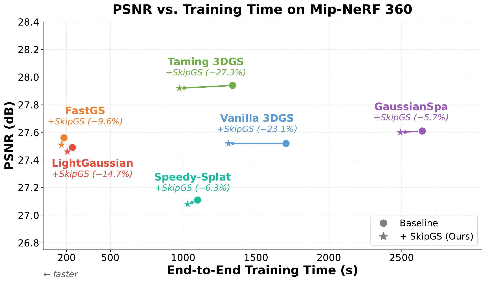
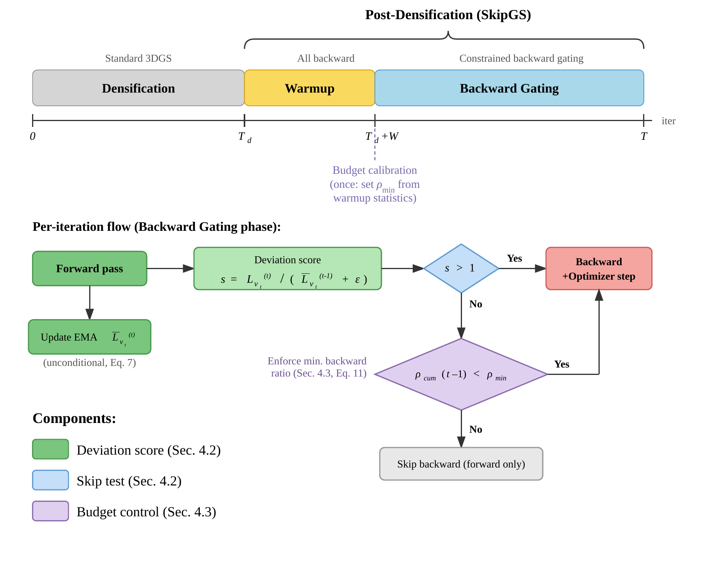

# SkipGS: Post-Densification Backward Skipping for Efficient 3DGS Training

[Jingxing Li](https://github.com/ASU-ESIC-FAN-Lab), Yongjae Lee, and Deliang Fan

Arizona State University

**[Paper (arXiv)](https://arxiv.org/abs/2603.08997)** · ECCV 2026

SkipGS skips the backward pass on 3DGS training views that have already
converged. After densification ends, the backward pass dominates iteration
cost (~62%), yet many sampled views have near-plateaued losses and contribute
weakly informative gradients. SkipGS keeps the forward pass (to track per-view
loss statistics) and selectively skips backpropagation when the sampled view's
loss is consistent with its recent per-view baseline, under a minimum backward
budget. On Mip-NeRF 360 it cuts end-to-end 3DGS training time by **23.1%**
(**42.0%** of post-densification time) at matched quality — and because it
only changes *when* to backpropagate, it plugs into other efficient 3DGS
pipelines (FastGS, Taming 3DGS, GaussianSpa, LightGaussian, Speedy-Splat) for
additive speedups.



## How it works



Per view, keep an EMA of the loss (updated every visit — the forward always
runs). Current loss at/below the EMA → nothing surprising → skip the backward
and optimizer step. A `warmup` window after densification seeds the EMAs and
calibrates a **minimum backward budget**: a floor on the fraction of real
backwards, enforced throughout, so skipping can never starve optimization.
No CUDA, no renderer or model changes, zero dependencies.

## Install

```bash
pip install -e .
```

## Use

Every 3DGS trainer — vanilla, gsplat, FastGS, Taming, your fork — has the same
core loop. SkipGS is one added line in it:

```python
from skipgs import SkipController

skip = SkipController(start_iter=15000)              # = your densify_until_iter

for iteration in range(1, 30001):
    cam = pick_training_view()
    loss = compute_loss(render(cam), gt)             # forward always runs
    if skip(cam.uid, loss.item(), iteration):        # ← the added line
        continue                                     # converged view: no backward, no step
    loss.backward()
    densification_hooks(...)                         # unchanged — SkipGS never skips
    optimizer.step()                                 #   before start_iter, so these
    optimizer.zero_grad(set_to_none=True)            #   always have their gradients

print(skip.summary())
# → {'total_bwd': 10433, 'total_skip': 4567, 'total_iter_post': 15000,
#    'bwd_ratio': 0.696, 'skip_ratio': 0.304, 'min_bwd_ratio_final': 0.696}
#   (a real run: vanilla 3DGS on Mip-NeRF 360 "counter", resumed 15k → 30k)
```

Porting to your trainer means making the same three decisions:

1. **What is `start_iter`?** Wherever your trainer stops densifying/refining —
   `densify_until_iter` in Inria-style trainers, `strategy.refine_stop_iter` in
   gsplat. Before it, SkipGS does nothing, so the densification path needs zero changes.
2. **What is a `view_id`?** Anything hashable that names the training view: camera
   uid, image filename. Batch trainer with one joint loss? Pass a constant id — the
   policy falls back to one global loss EMA and still works.
3. **What happens on a skip?** Everything gradient-related sits out this iteration:
   the backward, *every* optimizer's `step()`/`zero_grad()` (some trainers have
   several), any hook that reads `.grad`. LR schedulers keep running as normal.

Worked examples (validated on real training runs):
[gaussian-splatting](examples/integrate_gaussian_splatting.md) ·
[FastGS](examples/integrate_fastgs.md).

## Results

Mip-NeRF 360 (avg over 9 scenes). T_total = end-to-end wall-clock training
time (s); T_post = post-densification refinement time. SkipGS does not modify
the renderer or the Gaussian set, so rendering workload and #Gaussians are
identical to each baseline — the speedup comes solely from reducing
post-densification backpropagation.

| Method | PSNR↑ | SSIM↑ | LPIPS↓ | T_total↓ | T_post↓ |
|---|---|---|---|---|---|
| Vanilla 3DGS | 27.52 | 0.816 | 0.215 | 1705.7 | 939.6 |
| + SkipGS | 27.52 | 0.816 | 0.217 | **1311.1 (−23.1%)** | **545.0 (−42.0%)** |
| FastGS | 27.56 | 0.798 | 0.261 | 181.9 | 87.2 |
| + SkipGS | 27.51 | 0.797 | 0.262 | **164.5 (−9.6%)** | **69.8 (−20.0%)** |
| Taming 3DGS | 27.94 | 0.822 | 0.207 | 1339.0 | 757.0 |
| + SkipGS | 27.92 | 0.822 | 0.209 | **974.0 (−27.3%)** | **392.0 (−48.2%)** |
| GaussianSpa | 27.61 | 0.826 | 0.213 | 2640.9 | 1485.0 |
| + SkipGS | 27.60 | 0.825 | 0.215 | **2490.9 (−5.7%)** | **1335.0 (−10.1%)** |
| LightGaussian | 27.49 | 0.810 | 0.230 | 240.0 | 240.0 |
| + SkipGS | 27.46 | 0.809 | 0.231 | **204.8 (−14.7%)** | **204.8 (−14.7%)** |
| Speedy-Splat | 27.11 | 0.799 | 0.263 | 1099.8 | 492.0 |
| + SkipGS | 27.08 | 0.799 | 0.264 | **1030.8 (−6.3%)** | **423.0 (−14.0%)** |

Same story on Deep Blending (e.g. vanilla T_post −37.6% at +0.09 PSNR) and
Tanks&Temples (−36.8% at −0.05) — see the paper for full tables and ablations.

## API

| Param | Default | |
|-------|---------|---|
| `start_iter` | — | skipping starts here |
| `threshold` | `0.0` | >0 also skips slightly-above-average views |
| `ema_decay` | `0.95` | per-view loss EMA |
| `warmup` | `500` | no skipping, calibration only |
| `min_bwd_ratio` | `"auto"` | backward floor; float to set, `0.0` to disable |
| `enabled` | `True` | `False` = inert, for baseline runs |

That's the whole surface — everything else is fixed at the configuration all
experiments in the paper ran with. Also there when you need it:

- `skip.state_dict()` / `load_state_dict()` — checkpointing
- `should_skip()` + `record()` — two-call form, if you sometimes override the decision
  (`skip(...)` is short for `skip.decide(...)`, which does both at once)
- `decide_batch(ids, losses, it)` — separable per-view losses in a batch
- `step_mode="adaptive_norm"` — experimental, also spaces out optimizer steps:
  gradients accumulate until they carry more signal than noise, then one step fires
  (parameter-free; `step_trigger="ref_k"` for a fixed target instead). Gate the step
  on `skip.after_backward(params, it)` — it returns True on every iteration in the
  default mode, so the loop needs no other change
- `observe_visibility(mask)` / `window_visibility()` — for sparse/selective Adam:
  keeps the union of visibility masks over an accumulation window

## Caveats

- Saves backward + optimizer time, not forward. Speedup is bounded by your
  backward share of the iteration (largest for expensive trainers — see the
  Taming vs. FastGS rows above).
- Only skips after `start_iter`; densification is untouched.

## Citation

```bibtex
@misc{li2026skipgspostdensificationbackwardskipping,
      title={SkipGS: Post-Densification Backward Skipping for Efficient 3DGS Training}, 
      author={Jingxing Li and Yongjae Lee and Deliang Fan},
      year={2026},
      eprint={2603.08997},
      archivePrefix={arXiv},
      primaryClass={cs.CV},
      url={https://arxiv.org/abs/2603.08997}, 
}
```

## License

MIT.
